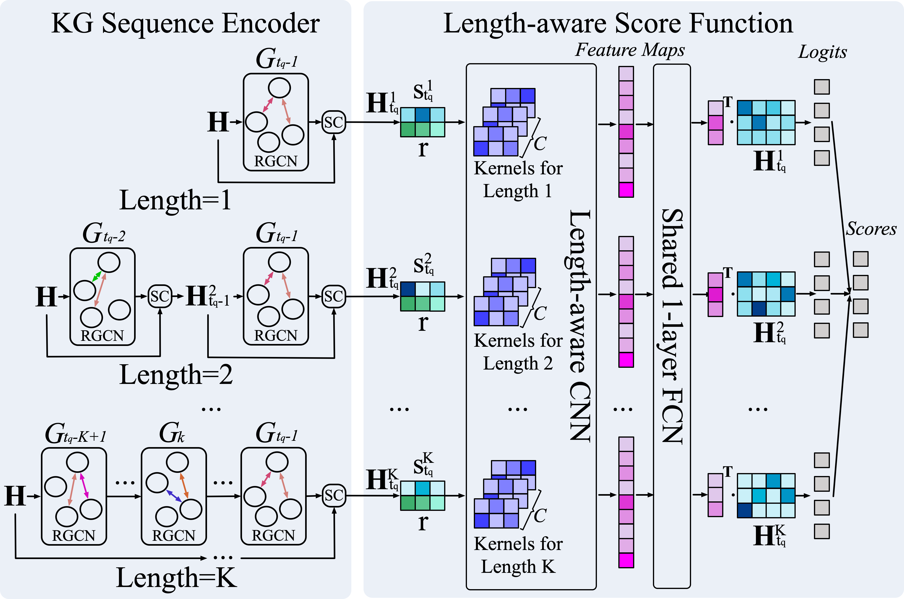
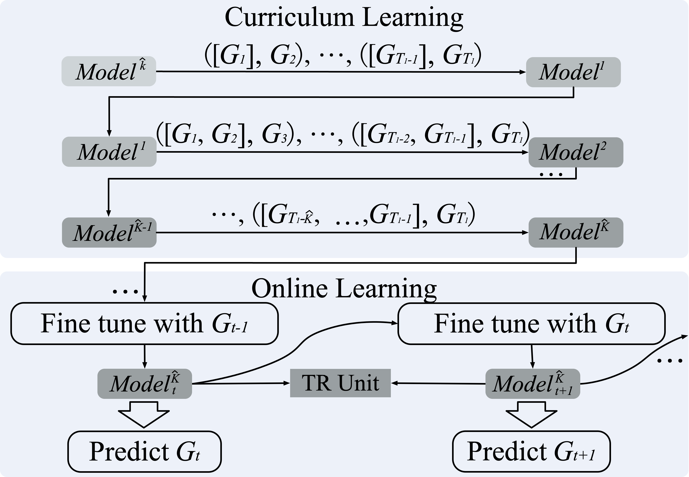

# Complex Evolutional Pattern Learning for Temporal Knowledge Graph Reasoning

This is the official code release of the following paper: 

Zixuan Li, Saiping Guan, Xiaolong Jin, Weihua Peng, Yajuan Lyu , Yong Zhu, Long Bai, Wei Li, Jiafeng Guo, Xueqi Cheng. [Complex Evolutional Pattern Learning for Temporal Knowledge Graph Reasoning](https://arxiv.org/pdf/2203.07782.pdf). ACL 2022.




## Quick Start

### Environment variables & dependencies
```
conda create -n cen python=3.7

conda activate cen

pip install -r requirement.txt
```

### Download and Process data
The dataset files can be found in the project of our SIGIR 2021 paper "Temporal Knowledge Graph Reasoning Based on Evolutional Representation Learning"[(RE-GCN)](https://github.com/Lee-zix/RE-GCN/blob/master/data-release.tar.gz).

First, unzip and unpack the data files,
```
tar -zxvf data-release.tar.gz
```


### Offline Training with Curriculum Learing
Then the following commands can be used to train the offline models.

1. Pretrain models with the minimum length.
```
cd src
python main.py --dilate-len 1 --n-epochs 30 --lr 0.001 --n-layers 2 --evaluate-every 1 --n-hidden 200 --self-loop --decoder convtranse --encoder uvrgcn --layer-norm  --entity-prediction --gpu 1 -d ICEWS14s --start-history-len 3 --train-history-len 10 --test-history-len 10 --test -1  --ft_lr=0.001 --norm_weight 1
```

2. Curriculum Training.
```
python main.py --dilate-len 1 --n-epochs 30 --lr 0.001 --n-layers 2 --evaluate-every 1 --n-hidden 200 --self-loop --decoder convtranse --encoder uvrgcn --layer-norm  --entity-prediction --gpu 1 -d ICEWS14s --start-history-len 3 --train-history-len 10 --test-history-len 10 --test 0  --ft_lr=0.001 --norm_weight 1
```


### Evaluate the offline models
To generate the evaluation results of a offline model, set the `--test` to 1 (for valid set) or 2 (for test set) and the `--test-history-len` to k (k is the optimal length of history when the MRR metric decreases in the valid set or the length is up to maximum length K) in the commands above. 

For example
```
python main.py --dilate-len 1 --n-epochs 30 --lr 0.001 --n-layers 2 --evaluate-every 1 --n-hidden 200 --self-loop --decoder convtranse --encoder uvrgcn --layer-norm  --entity-prediction --gpu 1 -d ICEWS14s --start-history-len 3 --train-history-len 10 --test-history-len k --test 2  --ft_lr=0.001 --norm_weight 1
```

### Online training data
First, train the models with timestamps in the valid set
```
python main.py --dilate-len 1 --n-epochs 30 --lr 0.001 --n-layers 2 --evaluate-every 1 --n-hidden 200 --self-loop --decoder convtranse --encoder uvrgcn --layer-norm  --entity-prediction --gpu 1 -d ICEWS14s --start-history-len 3 --train-history-len 10 --test-history-len k --test 3  --ft_lr=0.001 --norm_weight 1
```

Then, train the models with timestamps in the test set
```
python main.py --dilate-len 1 --n-epochs 30 --lr 0.001 --n-layers 2 --evaluate-every 1 --n-hidden 200 --self-loop --decoder convtranse --encoder uvrgcn --layer-norm  --entity-prediction --gpu 1 -d ICEWS14s --start-history-len 3 --train-history-len 10 --test-history-len k --test 4  --ft_lr=0.001 --norm_weight 1
```

### Change the hyperparameters
To get the optimal result reported in the paper, change the hyperparameters and other experiment set up according to Section 5 in the paper (https://arxiv.org/pdf/2203.07782.pdf). 

## Citation
If you find the resource in this repository helpful, please cite
```
@article{li2022complex,
  title={Complex Evolutional Pattern Learning for Temporal Knowledge Graph Reasoning},
  author={Li, Zixuan and Guan, Saiping and Jin, Xiaolong and Peng, Weihua and Lyu, Yajuan and Zhu, Yong and Bai, Long and Li, Wei and Guo, Jiafeng and Cheng, Xueqi},
  journal={arXiv preprint arXiv:2203.07782},
  year={2022}
}
```
